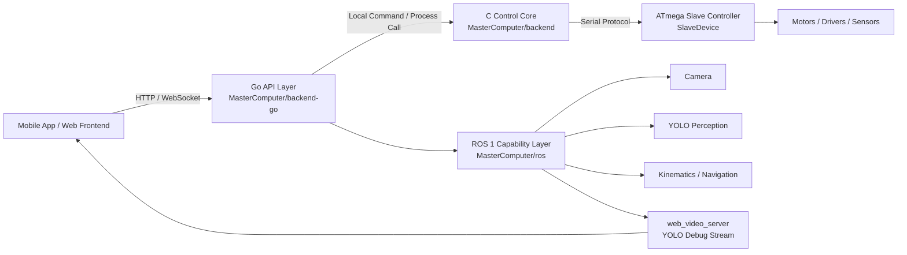
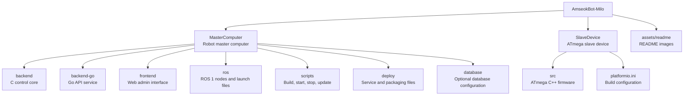

<h1 align="center">AmseokBot-Milo</h1>

<p align="center">
  <strong>ROS 1 기반 가정용 동반 로봇 소프트웨어 스택.</strong>
</p>

<p align="center">
  <a href="README.md">English</a> |
  <a href="README.zh-CN.md">中文</a> |
  <a href="README.ko-KR.md">한국어</a>
</p>

<p align="center">
  
</p>

AmseokBot-Milo는 로봇 마스터 컴퓨터와 하위 제어기를 위한 소프트웨어 저장소입니다. ROS 1 기반 가정용 동반 로봇을 목표로 하며, 비전 인식, 장애물 회피, 로봇 제어, 웹 기반 관리 인터페이스를 포함합니다.

시스템은 두 부분으로 나뉩니다.

- `MasterComputer`는 마스터 컴퓨터 소프트웨어 저장소입니다. C 제어 코어, Go API 계층, ROS 기능 계층, 프론트엔드 인터페이스를 포함합니다.
- `SlaveDevice`는 하위 제어기 소프트웨어 저장소입니다. 주로 ATmega 기반 하위 제어기 C++ 프로그램을 포함합니다.

## 주요 기능

AmseokBot-Milo는 소규모 팀이 유지보수하기 쉬운 실용적인 로봇 소프트웨어 스택을 목표로 합니다.

- 저지연 C 제어 코어를 통한 실시간 로봇 제어.
- Go 기반 HTTP/WebSocket API를 통한 프론트엔드, 모바일 앱, 로컬 도구 연동.
- ROS 1 노드를 통한 카메라, YOLO 인식, 장애물 회피, 운동학, 로봇 실험 기능.
- 실시간 영상, SSH 터미널, 파일 관리, 설정, 소프트웨어 업데이트를 제공하는 웹 관리 인터페이스.
- 모터 실행, 시리얼 통신, 하드웨어 제어를 담당하는 ATmega 기반 하위 펌웨어.

## 관리 인터페이스

웹 관리 인터페이스는 로봇 운용과 유지보수를 위한 주요 패널입니다. 다음 기능을 제공합니다.

- 실시간 카메라 및 YOLO 디버그 스트림 표시.
- 유지보수와 디버깅을 위한 내장 SSH 터미널.
- 파일 탐색, 업로드, 다운로드, 이동, 복사, 삭제 기능.
- 로봇 설정 및 소프트웨어 업데이트 작업.
- 로봇 마스터 컴퓨터 서비스를 통한 LAN 접속.

## 프로젝트 아키텍처



## 디렉터리 구조



## 계층별 역할

| 계층 | 경로 | 역할 |
| --- | --- | --- |
| C 제어 코어 | `MasterComputer/backend/` | 모터 제어, 시리얼 프로토콜, 섀시 이동, 로봇 팔 제어, 안전 제한, 로컬 명령 인터페이스. |
| Go API 계층 | `MasterComputer/backend-go/` | HTTP API, 인증, 프론트엔드/모바일 통신, 설정, 파일 관리, C 제어 코어 호출. |
| ROS 기능 계층 | `MasterComputer/ros/` | 운동학, 카메라 노드, YOLO 인식, 장애물 회피, 내비게이션 실험, 비디오 스트리밍. |
| 프론트엔드 | `MasterComputer/frontend/` | 브라우저 기반 로봇 관리 인터페이스. |
| 하위 펌웨어 | `SlaveDevice/` | ATmega 펌웨어, 하드웨어 실행과 시리얼 통신 담당. |

## 빠른 시작

```bash
cd AmseokBot-Milo
bash MasterComputer/scripts/start.sh
```

시작 후 브라우저에서 로봇 마스터 컴퓨터 주소를 엽니다.

```text
http://<robot-ip>:8080/
```

YOLO 디버그 스트림은 ROS web video server에서 제공합니다.

```text
http://<robot-ip>:8081/stream?topic=/obstacle_detector/debug
```

## 수동 빌드

```bash
cd MasterComputer/backend
make

cd ../backend-go
go test ./...
go build -o hostpc-api ./cmd/hostpc-api

cd ../frontend
pnpm install
pnpm run build
```

## 런타임 데이터 정책

비밀 정보, 로컬 사용자 데이터베이스, 생성된 런타임 데이터, 빌드 산출물, 로봇 로컬 상태는 Git에 커밋하지 않습니다. 실제 설치에서는 설치 스크립트나 최초 시작 과정에서 `/etc/amseokbot/`, `/var/lib/amseokbot/` 같은 시스템 경로에 생성해야 합니다.
