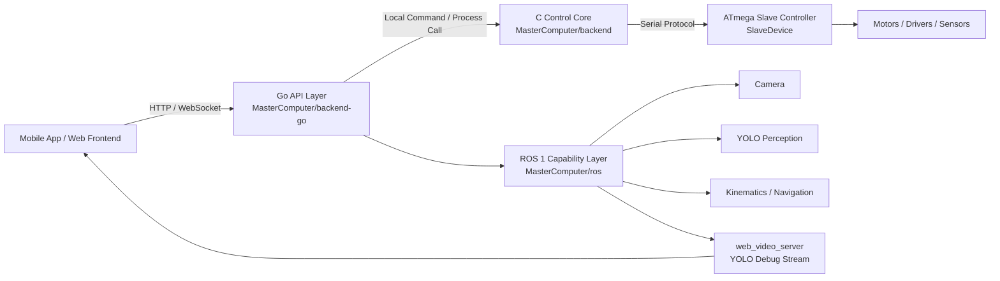
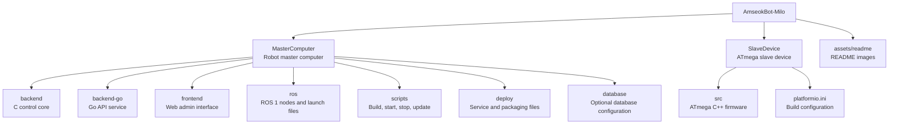

<h1 align="center">AmseokBot-Milo</h1>

<p align="center">
  <strong>A ROS 1 based home companion robot software stack.</strong>
</p>

<p align="center">
  <a href="README.md">English</a> |
  <a href="README.zh-CN.md">中文</a> |
  <a href="README.ko-KR.md">한국어</a>
</p>

<p align="center">
  
</p>

AmseokBot-Milo is a software repository for the robot master computer and slave controller. It is designed for a home companion robot built on ROS 1, with vision perception, obstacle avoidance, robot control, and a web based administration interface.

The system is split into two main parts:

- `MasterComputer` is the master computer software repository. It contains the C control core, Go API layer, ROS capability layer, and frontend interface.
- `SlaveDevice` is the slave controller software repository. It mainly contains the ATmega based lower-level controller program written in C++.

## What It Does

AmseokBot-Milo focuses on a practical robot software stack for a small team:

- Real-time robot control through a low-latency C control core.
- HTTP/WebSocket API through Go for frontend, mobile app, and local tools.
- ROS 1 nodes for camera, YOLO perception, obstacle avoidance, kinematics, and robot experiments.
- Web administration interface for real-time image display, SSH terminal access, file management, settings, and software update operations.
- ATmega based slave firmware for motor execution, serial communication, and hardware control.

## Admin Interface

The web administration interface is intended to be the main operation panel for the robot. It provides:

- Real-time camera and YOLO debug stream display.
- Built-in SSH terminal for maintenance and debugging.
- File management for browsing, uploading, downloading, moving, copying, and deleting files.
- Robot settings and update actions from the browser.
- LAN access through the robot master computer service.

## Project Architecture



## Directory Map



## Layer Responsibilities

| Layer | Path | Responsibility |
| --- | --- | --- |
| C control core | `MasterComputer/backend/` | Motor control, serial protocol, chassis motion, arm control, safety limits, local command interface. |
| Go API layer | `MasterComputer/backend-go/` | HTTP API, authentication, frontend/mobile communication, settings, file management, and calling the C control core. |
| ROS capability layer | `MasterComputer/ros/` | Kinematics, camera nodes, YOLO perception, obstacle avoidance, navigation experiments, and video streaming. |
| Frontend | `MasterComputer/frontend/` | Browser based robot administration interface. |
| Slave firmware | `SlaveDevice/` | ATmega firmware for hardware execution and serial communication. |

## Quick Start

```bash
cd AmseokBot-Milo
bash MasterComputer/scripts/start.sh
```

After startup, open the robot master computer address in a browser:

```text
http://<robot-ip>:8080/
```

The YOLO debug stream is served by ROS web video server:

```text
http://<robot-ip>:8081/stream?topic=/obstacle_detector/debug
```

## Build Manually

```bash
cd MasterComputer/backend
make

cd ../backend-go
go test ./...
go build -o hostpc-api ./cmd/hostpc-api

cd ../frontend
pnpm install
pnpm run build
```

## Runtime Data Policy

Secrets, local user databases, generated runtime data, build outputs, and robot-local state are not committed to Git. Production installation should generate runtime data under system locations such as `/etc/amseokbot/` and `/var/lib/amseokbot/` during installation or first startup.
