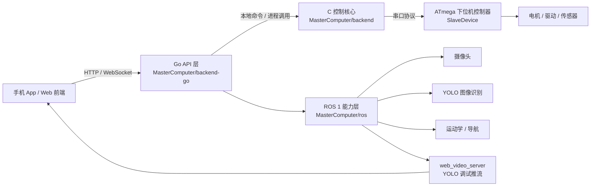
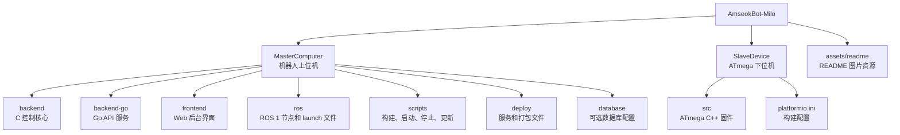

<h1 align="center">AmseokBot-Milo</h1>

<p align="center">
  <strong>基于 ROS 1 的家用陪伴型机器人软件栈。</strong>
</p>

<p align="center">
  <a href="README.md">English</a> |
  <a href="README.zh-CN.md">中文</a> |
  <a href="README.ko-KR.md">한국어</a>
</p>

<p align="center">
  
</p>

AmseokBot Milo 是机器人上位机与下位机软件仓库。

`MasterComputer` 为上位机仓库，包含 C 控制核心、Go API 层、ROS 能力层和前端界面。

`SlaveDevice` 为下位机仓库，主要是基于 ATmega 的下位机 C++ 程序。

AmseokBot-Milo 是一个基于 ROS 1 开发的家用陪伴型机器人软件栈，集成图像识别、YOLO 调试画面、自动避障、底盘运动控制、文件管理、SSH 维护终端和浏览器后台管理界面。

## 功能定位

AmseokBot-Milo 面向小团队开发和机器人本机部署，重点保持结构清晰、链路短、容易维护：

- 通过 C 控制核心实现低延迟机器人控制。
- 通过 Go 提供 HTTP/WebSocket API，服务前端、手机 App 和本地工具。
- 通过 ROS 1 节点提供相机、YOLO 感知、自动避障、运动学和机器人实验能力。
- 通过浏览器后台管理界面显示实时图像、SSH 终端、文件管理、设置和软件更新。
- 通过 ATmega 下位机固件执行电机控制、串口通信和硬件动作。

## 后台管理界面

后台管理界面是机器人本机维护和调试的主要操作面板，包含：

- 实时摄像头画面和 YOLO 带框调试画面。
- 内置 SSH 终端，方便维护和调试。
- 文件管理，支持浏览、上传、下载、移动、复制和删除。
- 机器人设置和软件更新操作。
- 通过局域网访问机器人上位机服务。

## 项目架构



## 目录结构



## 分层职责

| 分层 | 路径 | 职责 |
| --- | --- | --- |
| C 控制核心 | `MasterComputer/backend/` | 电机控制、串口协议、底盘运动、安全限幅、本地命令接口。 |
| Go API 层 | `MasterComputer/backend-go/` | HTTP API、登录鉴权、前端/手机通信、配置管理、文件管理、调用 C 控制核心。 |
| ROS 能力层 | `MasterComputer/ros/` | 运动学、摄像头节点、YOLO 识别、自动避障、导航实验和视频推流。 |
| 前端 | `MasterComputer/frontend/` | 基于浏览器的机器人后台管理界面。 |
| 下位机固件 | `SlaveDevice/` | ATmega 固件，负责硬件执行和串口通信。 |

## 快速启动

```bash
cd AmseokBot-Milo
bash MasterComputer/scripts/start.sh
```

启动后，在浏览器中打开机器人上位机地址：

```text
http://<robot-ip>:8080/
```

YOLO 调试画面由 ROS web video server 提供：

```text
http://<robot-ip>:8081/stream?topic=/obstacle_detector/debug
```

## 手动构建

```bash
cd MasterComputer/backend
make

cd ../backend-go
go test ./...
go build -o hostpc-api ./cmd/hostpc-api

cd ../frontend
pnpm install
pnpm run build
```

## 运行数据原则

真实密钥、本地用户数据库、运行数据、构建产物和机器人本机状态不提交到 Git。正式安装时，应由安装脚本或首次启动流程生成到 `/etc/amseokbot/`、`/var/lib/amseokbot/` 等系统目录。
